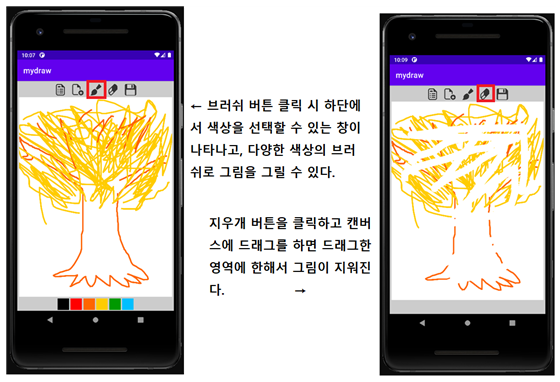
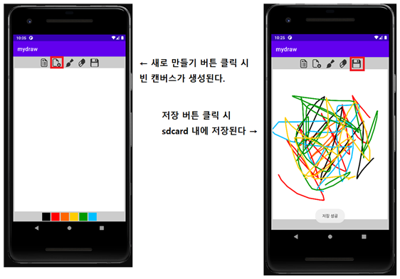
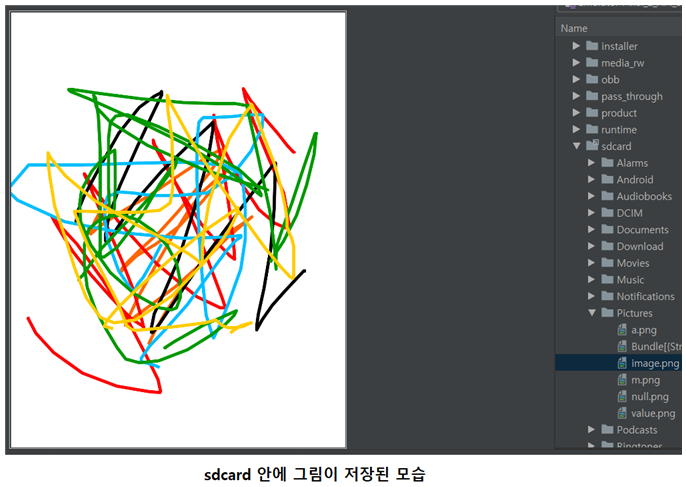

# SimpleDrawingBoard
Simple Drawing Board with JAVA

# 1. Project Overview (프로젝트 개요)
- 프로젝트 이름: 그림판 앱 개발
- 프로젝트 설명: (미니 프로젝트) Java를 이용하여 그림판 앱을 개발한다.


# 2. Members (팀원 소개)
| 허성욱 | 황지우 |
|:------:|:------:|
|||
| 경남대학교 | 경남대학교 | 
| [GitHub](https://github.com/dokpe01) | None | 

<br/>
<br/>

# 3. Key Features (주요 기능)
- 캔버스에 다양한 색상의 브러쉬를 마우스로 하여금 그림을 손 쉽게 그릴 수 있다.
- 적당한 두께의 지우개를 이용하여 그렸던 그림을 간단히 지울 수 있다.
- 그린 그림을 sdcard 에 저장하고 사용자가 직접 확인할 수 있다.
- 새로 만들기 버튼을 클릭하면 새 캔버스를 불러와 다시 그림을 그릴 수 있다.

<br/>
<br/>

# 4. Tasks & Responsibilities (역할 분담)
|  |  |  |
|-----------------|-----------------|-----------------|
| 허성욱    |   | <ul><li>(팀장) 프로젝트 총괄</li><li>Java 프로그래밍</li></ul>     |
| 황지우   |  | <ul><li>Java 프로그래밍</li><li></li></ul> |
<br/>
<br/>

# 5. Technology Stack (사용 기술)
|  |  |
|-----------------|-----------------|
| Java    || 

<br/>
<br/>

# 6. Project Structure (프로젝트 구조)
```plaintext
project/
├── #             #  
├── #             #  
└── #             #  
```

<br/>
<br/>

# 7. App Features (앱 기능)




    
<br/>
<br/>

# 7. What was difficult during the implementation (보완해야될 점)
1. 불러오기 버튼을 시간 내에 완성하지 못하였음

<br/>
<br/>
